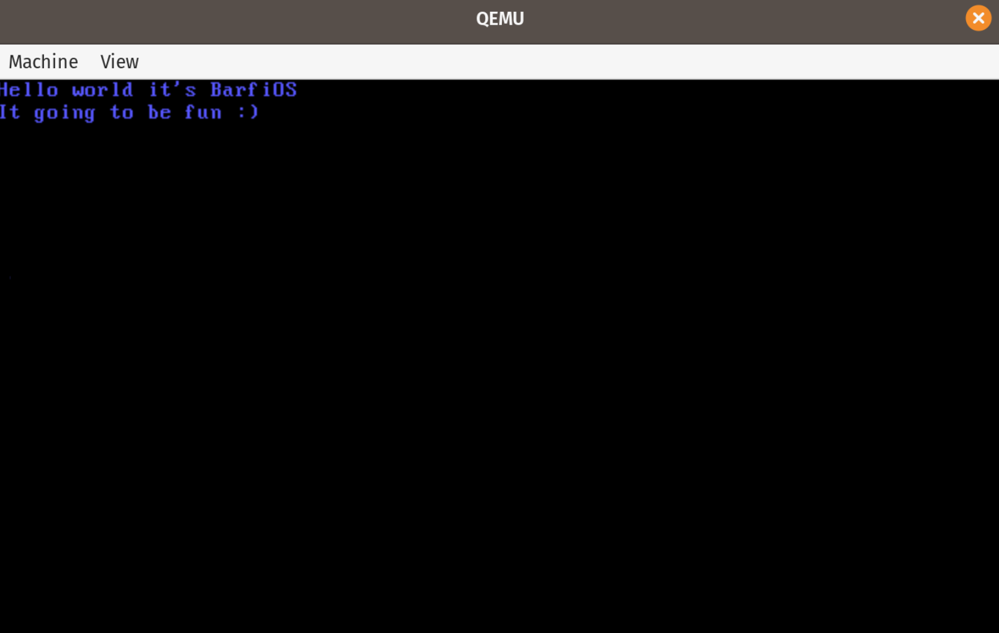

# BarfiOS
An ambitious project to implement an operating system from scratch.




##### compiling kernel:

Compile the `cpp` files with `-m32` to produce an 32 bit elf file.  
```
g++ -I ./include/ -c kernel/kernel.cpp   -c arch/i386/tty.cpp -ffreestanding -fno-exceptions -fno-rtti -m32
```
Compile the boostraping assembly file.

```
nasm -f elf32 arch/i386/boot.S -o kasm.o
```

link the `elfs` produce by assembly & gcc compiler using a linker.
```
ld -m elf_i386 -T link.ld -o Bkernel kasm.o kernel.o tty.o
```


Run the image in qemu:
```
qemu-system-i386 -kernel Bkernel
```


enjoy!!

